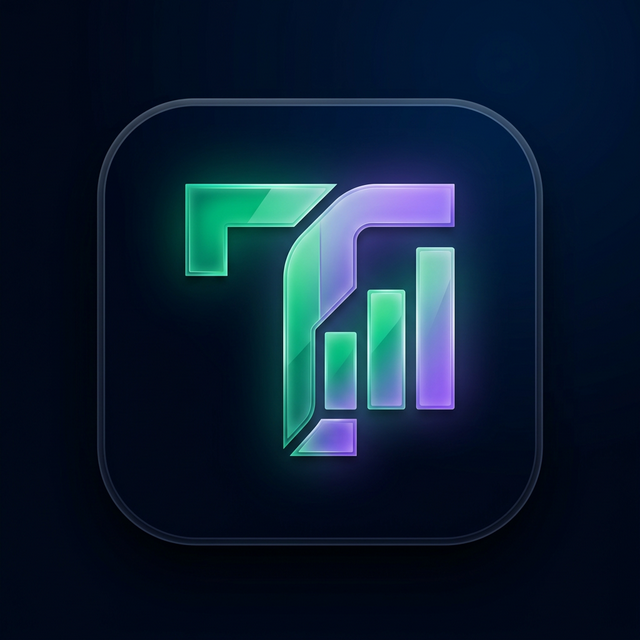

# 🏦 Taxlator

**Taxlator** is a world-class, artistic FinTech application designed to empower Nigerian professionals with precise tax tracking, salary projections, and financial insights. Built with a premium "Artistic V3" aesthetic, it combines powerful utility with a stunning, immersive user experience.



## ✨ Features

### 1. 🖼️ Financial Overview: 
- View your Gross Income, Estimated Tax, and Net Income in a modern "Bento Box" grid system.

### 2. 🧮 Smart Salary Calculator
- **PAYE Projections**: Calculate your take-home pay based on 2026 Nigerian tax regulations.
- **Multi-Currency Support**: Input salaries in NGN, USD, GBP, or EUR with automated exchange rate conversion.
- **Monthly & Yearly Breakdown**: Get detailed projections for both monthly and annual earnings.

### 3. 📈 Income Tracker
- **Earnings History**: Track multiple income streams with a clean, staggered history list.
- **Metrics at a Glance**: Real-time updates to your total annual gross and net income metrics.
- **Tax Savings Tracking**: Log tax-exempt contributions and savings to optimize your liability.

### 4. 📄 Professional Reports
- **PDF Export**: Generate high-fidelity, professional tax reports ready for sharing or printing.
- **Visual Analytics**: Interactive trend charts showing your income trajectory throughout the year.

---

## 🎨 Design Philosophy: "Artistic V3"

Taxlator isn't just a tool; it's a creative statement. The UI utilizes:
- **Glassmorphism**: Elegant transparency and blur effects on interactive elements.
- **Mesh Backgrounds**: High-end color-field gradients for a premium depth.
- **Typography-First Layout**: Using the `Outfit` font family for modern, readable, and impactful interfaces.
- **Soft Shadows & Glows**: Strategic layering for a true "floating" UI effect.

---

## 🚀 Getting Started

### Prerequisites
- Node.js (Latest LTS)
- Expo Go (on your mobile device)

### Installation
1. Clone the repository:
   ```bash
   git clone https://github.com/your-repo/taxlator.git
   ```
2. Install dependencies:
   ```bash
   npm install
   ```
3. Start the project:
   ```bash
   npx expo start
   ```

### Technical Stack
- **Framework**: Expo (React Native)
- **Language**: TypeScript
- **Animations**: Moti, Reanimated 4
- **Icons**: Ionicons (@expo/vector-icons)
- **Styling**: Vanilla StyleSheet with custom Design Tokens

---

## 🔒 Security & Privacy
- **Offline-First**: All data is stored locally on your device using `AsyncStorage`.
- **Private**: No financial data ever leaves your device unless you choose to export it.

---

## 📜 Version
Current Version: **v1.0.1 (Artistic Release)**

Developed with ❤️ for the Nigerian Financial Ecosystem.
